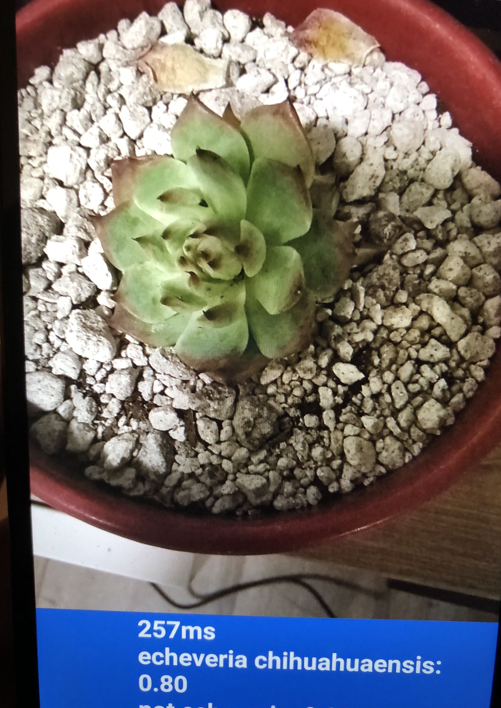

# Retrain-imgclassifier
This is a tutorial for retraining a mobilenet(or other neural network models) using tensorflow hub and deploying the retrained model on android using TFLite.

# Environment
- windows 10
- python 3.6

# Installation
- pip install tensorflow>=1.9
- pip install tensorflow-hub
- pip install google_image_download

# Data preparation
Google_image_download tutorial repo on github <https://github.com/hardikvasa/google-images-download>

The images of train dataset should be put in different folders which the folder names are image labels. \
For example: \
My training dataset <https://drive.google.com/open?id=1IUXQezDEZTdPWod2w39JRtzCbm0zUMtE> for building a Echeveria succulents
classifier. \
\Echeveria chihuahuaensis \
\Echeveria colorata \
\Echeveria momotaro \
\Echeveria monroe \
\Not Echeveria

I downloaded some random pictures in "Not Echeveria" folder to classify other objects.

# Retrain model
First we git clone the tensorflow-hub repo.
```
git clone https://github.com/tensorflow/hub.git
cd hub\examples\image_retraining
```
Start your retraining steps by executing following command:
```
python retrain.py \
    --image_dir /succulent_echeveria \
    --output_graph /result/output_graph.pb \
    --intermediate_output_graphs_dir /result/intermediate_result \
    --intermediate_store_frequency 1000 \
    --output_labels /result/output_labels.txt \
    --summaries_dir /result/retrain_logs \
    --how_many_training_steps 4000 \
    --learning_rate 0.01 \
    --testing_percentage 10 \
    --validation_percentage 10 \
    --eval_step_interval 10 \
    --train_batch_size 100 \
    --test_batch_size -1 \
    --validation_batch_size 100 \
    --bottleneck_dir /result/bottleneck \
    --final_tensor_name final_result \
    --flip_left_right False \
    --random_crop 0 \
    --random_scale 0 \
    --random_brightness 0 \
    --tfhub_module https://tfhub.dev/google/imagenet/mobilenet_v2_100_224/classification/2 \
```
You can try different hyperparameters or add some random modification to the images in order to get a more robust model. \
You can find different pre-build tfhub_module at <https://tfhub.dev/>, simply the model you like and copy the url to tfhub_module.

# Convert trained model to tflite model
Start a Linux virtual machine, install tensorflow and necessary dependency, and transfer the trained model to virtual machine,
the toco command used in google codelab didn't work for me for some reason. Instead tflite_convert works fine.
run:
```
tflite_convert --output_file=output_model_path/converted_model.tflite 
--graph_def_file=path_where_you_save_trained_model/output_graph.pb 
--input_arrays=Placeholder --output_arrays=final_result 
```

# Deploy on Android
Install android studio, and clone the google codelab repository,

```
git clone https://github.com/googlecodelabs/tensorflow-for-poets-2

cd tensorflow-for-poets-2
```
Copy and paste the converted_model.tflite and output_labels.txt to 
ensorflow-for-poets-2-master\android\tflite\app\src\main\assets , 
rename the model to graph.lite and the output_labels.txt to labels.txt.

# Build the app
Connect to a android device with version >= android 5.x (lollipop), activate "developer mode" and "USB Debugging". 
Build the app and the result should look like this:

<div style='float: center'>
  </img>
</div>
